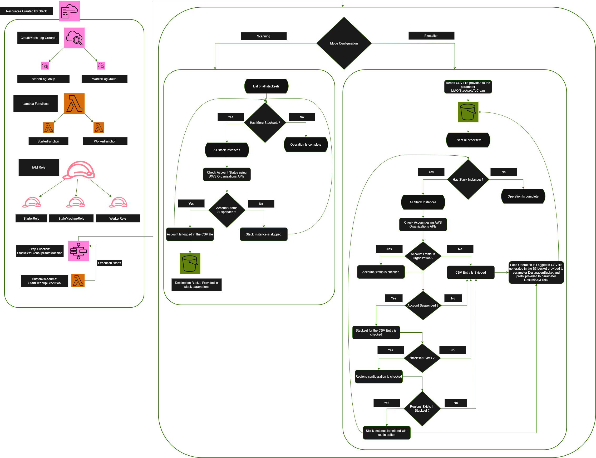
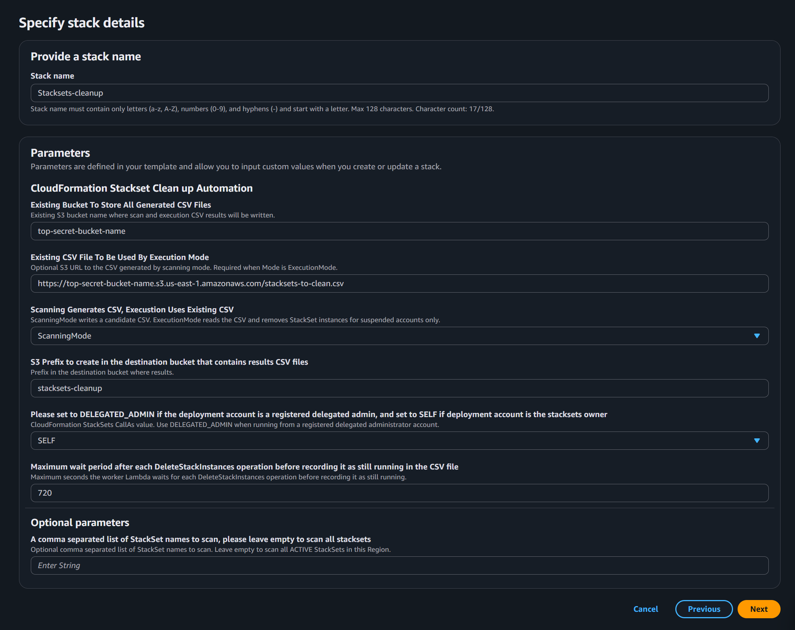

# CloudFormation StackSets Cleanup Automation


Automated cleanup solution for AWS CloudFormation StackSets, designed to identify and manage suspended stack instances at enterprise scale.

> **Disclaimer:** Code is provided as-is to demonstrate a concept or workflow for AWS customers. You are responsible for ensuring it meets your requirements and for thoroughly reviewing and testing it in a sandbox environment before deploying to production.

---

## Table of Contents

* [Overview](#overview)
  * [Understanding the Problem](#understanding-the-mixed-governance-problem)
  * [Effect On Related Services](#effect-on-related-services)
  * [Understanding the issue at scale](#why-this-becomes-challenging-at-scale)
  * [The Automation Strategy](#the-automation-strategy)
* [Prerequisites](#prerequisites)
* [Architecture-Overview](#architecture-overview)
  * [Services](#services)
  * [Architecture](#architecture)
    * [Deployment Configuration](#deployment-configuration)
    * [Parameters Overview](#parameters-overview)
  * [Lambda Functions WorkerFunction Logic Deep-Dive](#lambda-functions-workerfunction-logic-deep-dive)
    * [Scanning Mode](#lambda-logic-1)
    * [Execution Mode](#lambda-logic-2)
  * [Lambda Functions StarterFunction Overview](#lambda-functions-workerfunction-logic-deep-dive)
* [FAQs](#faqs)
* [Cleanup](#cleanup)
* [Tenets](#tenets)
* [Revisions](#revisions)
* [Notices](#notices)
* [Authors](#authors)
* [Security](#security)
* [License](#license)

---

# Overview

## Understanding the Problem

It’s understandably frustrating to wait 30 minutes, sometimes even two hours, only to see your deployment fail again.

StackSet failures can occur for many reasons. In this article, we focus on a specific yet common scenario: **unblocking StackSets that contain suspended or closed account stack instances**.

One AWS-provided solution that is particularly prone to this issue is **CFCT**. If even a single StackSet includes a suspended stack instance, the entire deployment can repeatedly fail until the issue is addressed.

While this is not the only cause of StackSet failures, the objective here is clear:
**identify and safely remove suspended stack instances so deployments can proceed normally.**

In other words, we are addressing what can be considered **the silent deployment killer**.

Let’s walk through why this happens, why it becomes operationally challenging at scale, and how you can automate the remediation process in a safe and effective way.

---

## Effect On Related Services

Managing CloudFormation StackSets at scale can become increasingly challenging when The Organization includes accounts that are suspended, closed, or otherwise no longer reachable.

Stack instances targeting these accounts are not automatically updated and will continue to show a status of **SUCCEEDED** until a new deployment is triggered. Once a deployment is initiated after the account has been closed, the status transitions from **SUCCEEDED**. At this point, future StackSet operations begin to fail if any [DeleteStackInstances](https://docs.aws.amazon.com/AWSCloudFormation/latest/APIReference/API_DeleteStackInstances.html) is invoked by the service because CloudFormation is unable to perform actions against these invalid targets.

This behavior introduces operational friction, especially in large multi-account environments where StackSets are heavily used for governance, security baselines, configuration management, or Control Tower deployments.

For example, in Control Tower, if an account is closed before it has been fully unmanaged, it may remain registered and referenced across multiple Control Tower-managed StackSets. Any subsequent updates to these StackSets can fail due to the presence of suspended stack instances.

Similarly, solutions like CFCT deploy StackSets across all governed accounts. If an account later becomes suspended and is not removed from the StackSet targets, CloudFormation continues attempting operations against that account.

This creates a feedback loop within the `CustomControlTowerStacksetStateMachine`, which can eventually fail due to the well-known execution history limit in AWS Step Functions.


```json
{
  "timestamp": "2026-02-12T23:25:07.483000+00:00",
  "type": "ExecutionFailed",
  "id": 25000,
  "previousEventId": 24999,
  "executionFailedEventDetails": {
    "error": "States.Runtime",
    "cause": "The execution reached the maximum number of history events (25000)."
  }
}
```

Step Functions executions are limited to **25,000 history events**, and once this threshold is reached, the execution fails.

What makes this particularly frustrating is not just the failure itself, but the time it takes to get there. Executions can run for hours before hitting this limit, only to fail at the end. Retrying the workflow does not resolve the issue and instead leads to a repeated failure cycle until manual intervention is performed.

---

## Why This Becomes Challenging at Scale


The root cause is straightforward:

CloudFormation attempts to delete or update a stack instance in an account that is suspended or closed. Since the account is no longer accessible, the operation cannot complete successfully.

By default, the [DeleteStackInstances](https://docs.aws.amazon.com/AWSCloudFormation/latest/APIReference/API_DeleteStackInstances.html) operation attempts to delete the stack instance from the target account. When the account is suspended, the request is never received, which leads to the failure.

To break this loop, the suspended account must be removed from the StackSet. Because the account is no longer accessible, this requires deleting the stack instance using the **RetainStacks** option, which is not enabled by default.

This approach ensures that CloudFormation stops tracking the stack instance without attempting further operations in the unreachable account, effectively unmanaging the instance.

While this cleanup can be performed manually, it becomes operationally expensive in medium to large organizations with multiple regions and numerous StackSets. Even a single suspended instance can be difficult to identify and remove at scale.

As a result, automation becomes necessary.

---

<a id="automation-strategy"></a>

# The Automation Strategy

To address this, the solution automates the process of identifying suspended accounts, even in cases where no updates have been pushed to the StackSets and the status still appears as **SUCCEEDED**.

This is achieved by scanning every StackSet within the same region where the stack is deployed. The automation iterates through all stack instances in each StackSet and validates the account status using the [describe_account](https://docs.aws.amazon.com/boto3/latest/reference/services/organizations/client/describe_account.html#) API. This allows the solution to detect stack instances associated with accounts that have already been suspended, even if their status has not yet been refreshed by CloudFormation.

The automation then compiles a CSV file containing the relevant details of these findings. This file can be reviewed and used as a basis for safely cleaning up the affected StackSets.

We will take a deeper look at the logic and implementation of this automation later in the article.

---

# Prerequisites

Before deploying this solution, please ensure the following prerequisites are met:

1. A functional AWS account is available.
2. You have sufficient permissions to deploy the CloudFormation stack and all associated resources.
3. You have sufficient permissions to perform cleanup operations on StackSets.

---

# Architecture-Overview

## Services

The solution utilizes:

* AWS Lambda
* AWS Organizations
* CloudWatch Logs
* IAM
* CloudFormation
* StepFunctions

---

## Architecture
Let’s take a look at the automation workflow.

The diagram below illustrates the main components of the solution, which we will explore in more detail throughout the next sections.


---

  ## Stackset Engine Deployment Behavior Deep-Dive

   1. CloudFormation begins by deploying a set of mandatory resources. These resources are created regardless of the parameter configuration.
       1. CloudWatch Log Groups
          1. StarterLogGroup
          2. WorkerLogGroup
       2. Lambda Functions
          1. StarterFunction
          2. WorkerFunction
       3. IAM Roles
          1. StarterRole
          2. StateMachineRole
          3. WorkerRole
       4. State Machine
          1. StackSetsCleanupStateMachine
       5. Custom Resource
          1. StartCleanupExecution

  ## Deployment Configuration

  

### Parameters Overview

   1. **DestinationBucket** <a id="parameter-1"></a>
      * This parameter specifies the existing S3 bucket that will store all CSV files generated by the automation in both ScanningMode and ExecutionMode.

   2. **ExistingCleanupCSV** <a id="parameter-2"></a>

      1. This parameter is used only when the stack parameter **Mode** is set to ExecutionMode.
      2. It provides the CSV file that the automation will process.
      3. The CSV file does not need to reside in the same bucket specified in **[DestinationBucket](#parameter-1)**.

   3. **ResultsKeyPrefix** <a id="parameter-3"></a>

      1. This parameter defines the prefix that will be created in the **[DestinationBucket](#parameter-1)**.
      2. In **ScanningMode**, the following files will be generated under this prefix <a id="parameter-32"></a>:

         * `work-scan.json`
         * `scan-results.csv`
      3. In **ExecutionMode**, the automation generates:

      * `execution-results.csv` <a id="parameter-33"></a>

   4. **Mode** <a id="parameter-4"></a>

      * When set to **ScanningMode**, the automation scans StackSets for suspended accounts. Results are stored in `scan-results.csv` under the **[ResultsKeyPrefix](#parameter-32)**.
      * When set to **ExecutionMode**, the automation reads the CSV file provided in **[2](#parameter-2)**. A series of validations are performed as described in **[CSV Validation](#execution-logic-24)** <a id="parameter-42"></a>.
      * If validation succeeds, results are written to `execution-results.csv` as described in **[3.3](#parameter-33)**.

   5. **OperationWaitSeconds** <a id="parameter-5"></a>
      This parameter defines the maximum time to wait after invoking [DeleteStackInstances](https://docs.aws.amazon.com/AWSCloudFormation/latest/APIReference/API_DeleteStackInstances.html).
      If the operation is still in progress after this period, it will be marked as **IN_PROGRESS** in the generated CSV file.

   6. **CallAs** <a id="parameter-6"></a>

      * Set to **SELF** if the deployment account is the StackSet owner.
      * Set to **DELEGATED_ADMIN** if the deployment account is a registered delegated administrator.
      * If both types of StackSets exist, please refer to the **[FAQs](#faqs-1)**.

   7. **StackSetsToScan** <a id="parameter-7"></a>

      * A comma-separated list of StackSet names that the automation will scan during **ScanningMode**.
      * In **ExecutionMode**, StackSets are derived from the CSV file, not this parameter, as described in **[2](#parameter-2)** and **[4.2](#parameter-42)**.

---

## Lambda Functions: WorkerFunction Logic Deep-Dive

   ### 1. ScanningMode <a id="lambda-logic-1"></a>

   1. As described in **[3.2](#parameter-32)**, the generated CSV file is `scan-results.csv` when the Mode is set to `ScanningMode`.
   2. The Lambda processes one StackSet at a time to avoid throttling the environment. To track progress, the file `work-scan.json` serves as the source of truth for the state machine when invoking the Lambda function.
   3. For each StackSet, the Lambda scans all stack instances and validates account status using the Organizations API [describe_account](https://docs.aws.amazon.com/boto3/latest/reference/services/organizations/client/describe_account.html#).
   4. An account is considered `SUSPENDED` only when the `Status` field explicitly shows `SUSPENDED`. All other statuses are treated as active, including `PENDING_CLOSURE`, since the account is not fully closed.
   5. Once a suspended account is identified, the region configuration is retrieved from the StackSet.
   6. All findings are recorded in the CSV file, which is continuously updated as the automation progresses.
   7. The generated CSV file is available in the CloudFormation stack outputs under the `LatestScanResults` variable. <a id="lambda-logic-17"></a>

   ---

   ### 2. ExecutionMode <a id="lambda-logic-2"></a>

   1. As described in **[3.3](#parameter-33)**, the generated CSV file is `execution-results.csv` when the Mode is set to `ExecutionMode`.
   2. In this mode, the automation reads the CSV file provided via the **[ExistingCleanupCSV](#parameter-2)** parameter, which serves as the input source.
   3. The CSV file can reside in any S3 bucket and is not restricted to the **[DestinationBucket](#parameter-1)** parameter.
   4. The CSV file is validated as follows <a id="execution-logic-24"></a>:
      1. The minimum required header must match:
         | StackSetName      | AccountId   | Regions             |
         | ----------------- | ----------- | ------------------- |
         | secret-stackset-1 | 11122233344 | us-east-1,us-east-2 |
         | secret-stackset-2 | 44455566677 | us-east-1           |

      2. If the header is missing or incorrect, the automation fails with the following message logged in the `WorkerLogGroup` log group:
         ```
         CSV header is missing required column(s): StackSetName, AccountId, Regions. Required columns are: StackSetName, AccountId, Regions. ExecutionMode will not process this file to avoid data confusion
         ```
   5. You can use the **[scan-results.csv](#parameter-32)** generated from **[ScanningMode](#lambda-logic-1)**. The latest file is available under **[LatestScanResults](#lambda-logic-17)** in the stack outputs. Alternatively, you can provide a custom CSV file without running ScanningMode, as long as it passes the required **[validation](#execution-logic-24)**. <a id="execution-logic-25"></a>
   6. After file-level validation, each CSV entry is validated sequentially. If any validation step fails, the entry is skipped and logged in both `execution-results.csv` and the `WorkerLogGroup` log group:
      1. Each account is validated again using the AWS Organizations API [describe_account](https://docs.aws.amazon.com/boto3/latest/reference/services/organizations/client/describe_account.html#) to confirm it is in a suspended state for safe processing.
      2. Each StackSet name is validated to ensure it exists.
      3. The region configuration is validated to ensure it matches the StackSet configuration.
   7. If the CSV entry passes all validations, the automation invokes the [DeleteStackInstances](https://docs.aws.amazon.com/AWSCloudFormation/latest/APIReference/API_DeleteStackInstances.html) API. The process waits for completion, up to the limit defined by **[OperationWaitSeconds](#parameter-5)**. If the operation does not complete within this time, it is recorded as **IN_PROGRESS** in `execution-results.csv`.
   8. The CSV file is updated after each operation.

   ---

   ## Lambda Functions: StarterFunction Overview

   * The purpose of the StarterFunction Lambda is to initiate the state machine.
   * The core automation logic is handled by the **[WorkerFunction](#lambda-functions-workerfunction-logic-deep-dive)**.

---
## FAQs

### 1. How can I configure the automation if I have a mix of delegated admin StackSets and self-owned StackSets? <a id="faqs-1"></a>

1. In this scenario, you must limit the automation to target one type of StackSet at a time.
2. Use the parameter **[StackSetsToScan](#parameter-7)** to restrict the automation to a specific list of StackSets, and ensure the **[CallAs](#parameter-6)** parameter matches the permission model of those StackSets.
3. The StackSets listed in **[StackSetsToScan](#parameter-7)** must all be of the same type, either self-owned or delegated admin StackSets.

---

### 2. CSV is not validated and the automation is failing

* Please refer to **[CSV Validation](#execution-logic-24)** to ensure your CSV file is correctly formatted.
* Alternatively, run **[ScanningMode](#lambda-logic-1)** first to generate a valid **[scan-results.csv](#parameter-32)** file, which will be available under **[LatestScanResults](#lambda-logic-17)** in the stack outputs.

---

## Cleanup

* Begin by deleting the stack. All associated resources will be removed by default.
* All generated files will remain in the location defined by **[ResultsKeyPrefix](#parameter-3)**. Deleting the stack does not remove these files, so they must be cleaned up manually if no longer needed.

---

## Tenets

* **Works at any scale:** Designed to support organizations of any size by leveraging lifecycle events as the primary automation trigger.

* **Flexible:** The solution is intentionally configurable, allowing you to adjust parameters to align with your governance model and operational requirements while maintaining compliance.

* **Do no harm:** No destructive actions are performed against workloads. The only delete operations executed by the solution are limited to removing Stack Instaces For Suspended Accounts.

* **No assumptions:** The solution does not assume a specific configuration. It is important to review your internal limitations, service quotas, and governance policies in advance to ensure proper alignment.

---

## Revisions

- 2026-05-12 - Initial release

## Notices

Customers are responsible for making their own independent assessment of the information in this Guidance. This Guidance: (a) is for informational purposes only, (b) represents AWS current product offerings and practices, which are subject to change without notice, and (c) does not create any commitments or assurances from AWS and its affiliates, suppliers or licensors. AWS products or services are provided “as is” without warranties, representations, or conditions of any kind, whether express or implied. AWS responsibilities and liabilities to its customers are controlled by AWS agreements, and this Guidance is not part of, nor does it modify, any agreement between AWS and its customers.

This library is licensed under the MIT-0 License. See the [LICENSE](LICENSE) file.

## Authors
- Karim Omar, Cloud Support Engineer

## Security

See [CONTRIBUTING](CONTRIBUTING.md#security-issue-notifications) for more information.

## License

This library is licensed under the MIT-0 License. See the LICENSE file.